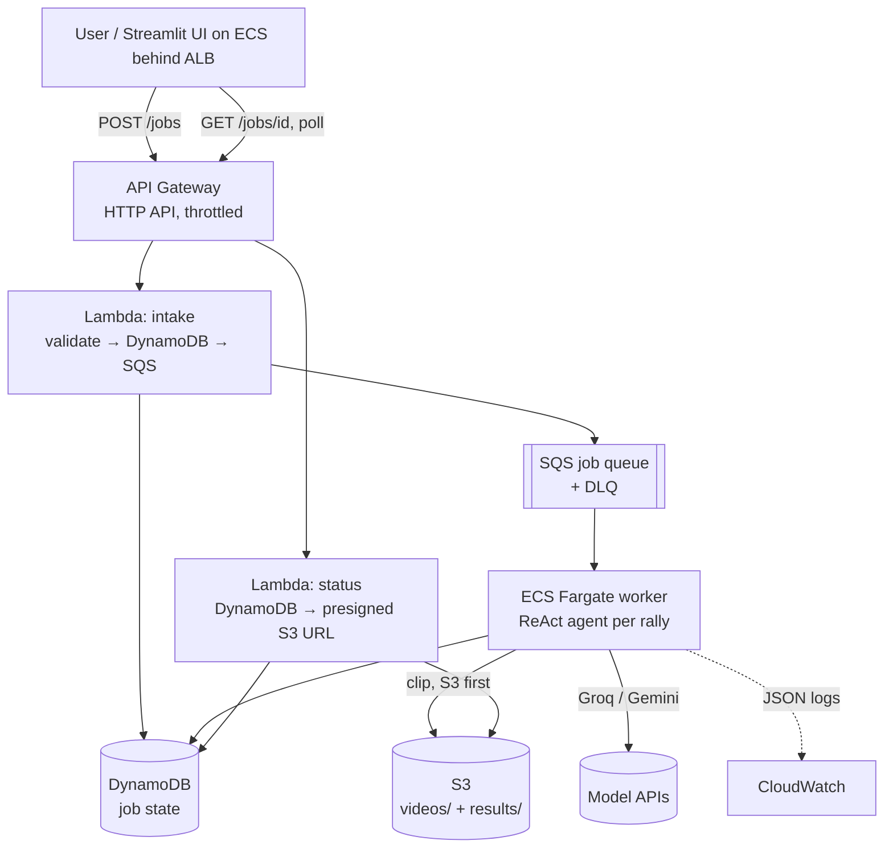

# ShuttleCast

**Per-rally tactical analysis for professional badminton.** A LangChain
ReAct agent reads each rally's stroke-by-stroke data from the
[ShuttleSet](https://arxiv.org/abs/2306.04948) dataset (KDD 2023) together
with broadcast frames pulled at the exact moment of every stroke, decides
whether the rally is worth analyzing, and writes a coaching note: what went
wrong, and what the player should have done instead.

| | |
| --- | --- |
| **Problem** | Most badminton matches (amateur leagues, regional tournaments) never get a human analyst, and most footage has no stroke annotations. |
| **What I built** | Stroke-recognition models trained on ShuttleSet that turn any match video into labelled rallies; a ReAct agent that decides per rally what is worth analyzing and writes the coaching note; deployed as an async queue-backed AWS service. |
| **Impact** | Hit detection on raw broadcast footage: F1 **0.87**, vs 0.37 for the audio baseline. Coaching notes that blame the right player: **62% → 94%**. QLoRA on a 2B model took format compliance from **0% to 100%** for under $0.20 of GPU time. |

**Demo** (3 min, live AWS deployment; waits are fast-forwarded and labelled):

<!-- DEMO_VIDEO: paste the github.com/user-attachments/assets/... link on its own line here -->

```text
Set 1 / Rally 2 — won by B                                   depth: surface
[Action]      analyze_stroke_sequence()            -> 4 strokes: unknown, clear, clear, wrist smash
[Action]      assess_rally_significance()          -> surface
[Action]      get_match_context()                  -> score 0-0, no history
[Action]      generate_analysis(depth="surface", suggestion_type="shot_selection")
PATTERN:    A's third-shot clear was suboptimal — it gave B time to reset and
            unleash a winning wrist smash.
SUGGESTION: A should have attacked with a sharp drop or a drive to the front
            court, forcing a weak reply and denying B the smash.
```

## What it demonstrates

- **Works on any match video**: models trained on ShuttleSet's labelled
  strokes detect and classify shots in a YouTube link or uploaded file
  (hit-detection F1 0.84–0.87 on raw broadcast footage), so the agent
  isn't limited to annotated matches.
- **Multimodal**: structured stroke data (shot types, positions, landing
  zones) and broadcast frames processed together per rally, with ShuttleSet's
  `frame_num` driving frame extraction.
- **An agent that actually decides**: three branching decisions per rally
  (below) change both the work done and the output, so it isn't a fixed
  pipeline with an agent label on it.
- **Production AWS architecture**, as one CloudFormation stack: API Gateway,
  Lambda, SQS with a dead-letter queue, ECS Fargate, ALB, S3, DynamoDB,
  CloudWatch, ECR.
- **Fine-tuning**: QLoRA distillation of a 70B teacher into Qwen2-VL-2B on a RunPod GPU,
  with the whole train/eval path smoke-tested on CPU before it touches a GPU.
- **Measured, not estimated**: every number below comes from a script in
  this repo, and each one states its baseline.

## Architecture



| Component | Why it's there |
| --- | --- |
| API Gateway (HTTP API) | Managed HTTPS plus per-route throttling (5 rps, burst 10); every job costs model calls |
| Lambda intake / status | Job intake takes milliseconds. Both are boto3-only, so the zips stay tiny and cold starts fast |
| SQS + DLQ | Decouples bursty submissions from slow processing; failed jobs land somewhere inspectable |
| ECS Fargate worker | A match takes longer than Lambda's 15-minute ceiling |
| S3 | Input clips and result JSON. The bucket stays private; results go out via presigned URLs |
| DynamoDB | `job_id → state` lookups, on-demand billing |
| CloudWatch | Structured per-stage logs answer "what's the p95 latency of vision analysis?" |

### Reliability details

- **Duplicate deliveries**: SQS is at-least-once, so the worker treats an
  already-`complete` job as a no-op.
- **Visibility heartbeat**: the worker extends visibility after every rally,
  so a long match is never redelivered to a second worker mid-run.
- **Retries**: 3 attempts with backoff, then the worker marks the job
  `failed` itself (the DLQ threshold of 5 sits above that).
- **Write order**: intake writes DynamoDB *before* SQS, so a worker can
  never receive a job_id that doesn't exist yet.
- **Graceful shutdown**: on SIGTERM the worker finishes its current job and
  takes no new one.

### Cost choices

- Fargate tasks run in public subnets with no inbound rules, which avoids a
  ~$32/month NAT gateway.
- API keys live in SSM SecureString, not in the template or the image.
- ECR lifecycle rules keep only the last 5 images.
- `scripts/teardown.sh` exists because the ALB bills hourly whether anyone
  uses it or not.

## The agent's three decisions

1. **Visual-stroke consistency.** If the stroke data alone leaves the
   tactical cause ambiguous, the agent asks the vision model a targeted
   question about the frames; otherwise it skips that call.
2. **Significance gate.** `assess_rally_significance` returns
   `skip | surface | deep`. A clean winner gets skipped; a decisive weakness
   gets a full analysis.
3. **Suggestion type.** The agent picks `positioning`, `shot_selection` or
   `pattern_exploitation`, and each maps to its own prompt template.

The tools read the current rally's stroke data and frames from bound
state instead of taking them as arguments. An earlier version had the model
pass the stroke summary back into later tool calls, and 4 of 20 rallies
failed with malformed JSON. Now tool arguments carry only the agent's own
decisions (the vision question, depth, and suggestion type).

## Results (measured)

**Frame extraction** — `scripts/measure_frame_savings.py`, 4 verified matches:

| Strategy | Frames sent to vision |
| --- | --- |
| Uniform 1 fps over the whole video | 11,425 |
| Uniform 1 fps inside rally windows only | 2,283 |
| **Stroke timestamps (ShuttleSet `frame_num`)** | **2,416** |

That's **78.9% fewer frames than naive uniform sampling**. Against a
baseline that already knows where the rallies are, the count is about the
same: strokes come roughly once a second. There the gain is landing on the
exact moment of contact, which uniform sampling can't do at any rate.

**Data integrity.** fps isn't constant across ShuttleSet: 19 of 44 matches
are 25 fps, the rest 30. Every clip is checked against the fps implied by
its annotations, and visually verified with `scripts/verify_alignment.py`.
One download had the right fps but was a different YouTube edit, and every
stroke frame landed on sponsor booths and close-ups. It's excluded in
[`data/verified_videos.json`](data/verified_videos.json).

**Agent analysis**: the first 20 rallies of An Se Young vs Pornpawee Chochuwong (Thailand Open 2021).

- *Reliability*: 4 of 20 rallies first failed because the model emitted
  malformed JSON while copying stroke data into tool arguments. After
  moving rally data out of tool arguments, 20 of 20 succeeded.
- *Tactical accuracy*: does the analysis blame the player who lost? It was
  62.5% at first, and the eval showed why: the model critiqued player B
  even in rallies B won. Stating the winner and loser in the generation
  prompt raised it to **93.8%** (15 of 16 analyzed rallies). That's an A/B
  with each rally's agent decisions held fixed (`scripts/ablate_generation_prompt.py`).
  Caveat: one match, 16 rallies, and the metric checks attribution, not
  the quality of the advice.
- *Decisions*: 7 deep, 10 surface, 3 skipped. Suggestion types skew
  heavily to `shot_selection` (16 of 17), so decision 3 needs more varied
  prompting to branch often.

**Stroke recognition from any video** (`vision/`). ShuttleSet's labelled
hit frames and shot types are used to train models that recover strokes
from footage nobody annotated (a YouTube link or an uploaded file). The
pipeline:

1. Find the court by colour and crop to it.
2. Extract frozen DINOv2 features, pooled to a 4×4 grid so player position
   survives.
3. Find hits with a temporal conv net.
4. Group the hits into rallies by cadence.
5. Classify each shot from the ~0.5s around the hit plus the flight time
   to the next hit.

The models are trained on 3,815 strokes from 6 matches; the threshold is
tuned on a 7th; tests are on an 8th match never seen in training.

| | Result | Baseline |
| --- | --- | --- |
| Hit detection F1 (±0.15s), rally windows + between-rally footage | **0.88** | 0.37 (audio onsets) |
| Hit detection F1 on **raw broadcast** (two 5-min windows, replays included) | **0.84–0.87** | 0.67 before hard negatives |
| Shot family accuracy (7 classes) at annotated hits | **54.8%** | 25.6% (majority class) |
| Shot type accuracy (18 classes) | **46.5%** | — |

What moved the numbers:

- *Keeping where players are* (4×4 grid features instead of one averaged
  vector) added +10 points on shot family.
- *Using the flight time to the next hit* added +6 points.
- *Training on between-rally footage as negatives*: before that, the
  detector fired on slow-motion replays, and raw-footage precision was
  0.49.

End to end on raw video, shot-family accuracy is ~43–46%, because small
timing errors shift what the classifier sees.

**Fine-tuning** (Qwen2-VL-2B + QLoRA vs the untuned model, 34 rallies from
held-out matches; `training/results/`). The model learns from the 70B
teacher's analyses. Training used 139 examples, 3 epochs and 54 steps, and
took 10.4 min on a RunPod RTX A5000 ($0.27/hr, under $0.20 in total).
Held-out eval loss fell from 1.153 to 1.067.

| | Untuned | Fine-tuned |
| --- | --- | --- |
| Follows the output format (`DEPTH / TYPE / PATTERN / SUGGESTION`) | 0% | **100%** |
| Suggestion similarity to teacher (sentence embeddings) | — | **0.72** mean (47% ≥ 0.75) |
| Blames the rally's loser | — (unparseable) | 100% |

The untuned model echoes the prompt template back
(`DEPTH: deep|surface|skip`) instead of filling it in, so a 2B model is
unusable here without fine-tuning. Caveats:

- The prompt states the rally winner, so attribution is easy.
- The teacher labelled almost every rally `deep / shot_selection` (all 34
  eval rallies, 128 of 141 training ones), so the 100% depth/type agreement
  with the teacher measures nothing. More varied teacher labels come before
  the next run.
- 0.72 similarity is below the 0.75 target.

**Tests**: 28 tests (`pytest tests/`). They cover the full intake → queue →
worker → S3 → status flow against moto's in-memory AWS (validation, retries,
duplicate delivery, phantom-job protection, uploads, partial results,
all-rallies-failed jobs) and every evaluation metric.

## Evaluation

| Layer | Question | Metric |
| --- | --- | --- |
| Tactical accuracy | Does the analysis blame the player who actually lost the rally? | Checked against ShuttleSet's `rally_winner`; no human labels needed |
| Suggestion quality | Is the advice close to a reviewed reference? | Sentence-embedding cosine similarity (target ≥ 0.75) |
| Visual-stroke consistency | Does the vision model see the shot ShuttleSet recorded? | Agreement on shot type, exact and by shot family |

```bash
python3 -m worker.eval.metrics data/results/<match_id>.json
```

Caveat: training references come from the same model family the agent uses
(gpt-oss-120b), so comparing the *agent* to those references is circular
until a human reviews them. That's why every label carries
`needs_review: true`. Comparing the *student* to its teacher is the standard
distillation eval.

## Running it

### Local (no AWS)

```bash
cp .env.example .env              # add GROQ_API_KEY (GEMINI_API_KEY optional: enables vision)
pip install -r worker/requirements.txt -r ui/requirements.txt
python3 scripts/download_videos.py --count 4
python3 scripts/verify_alignment.py <match_id> data/videos/<match_id>.mp4
python3 scripts/local_run.py --list
python3 scripts/local_run.py --match-id <match_id> --max-rallies 10
streamlit run ui/app.py           # local mode: per-rally agent runs or saved results
```

### AWS

Prerequisites: AWS CLI v2 with credentials (`aws configure`), and Docker
running.

```bash
scripts/deploy_infra.sh           # stack + SSM secrets; services start at 0 tasks
scripts/deploy_api.sh             # upload both Lambda handlers
python3 scripts/upload_videos.py  # verified clips → s3://.../videos/
scripts/deploy_worker.sh          # build + push images (git-SHA tags), scale to 1
# UI: the UiUrl stack output. Cap per-job cost with MAX_RALLIES=10 scripts/deploy_infra.sh
# Switch models without a rebuild (each Groq model has its own free-tier
# daily quota): GROQ_MODEL=openai/gpt-oss-20b scripts/deploy_infra.sh
scripts/teardown.sh               # delete everything when you're done
```

p95 latency per pipeline stage, from CloudWatch Logs Insights
(`/shuttlecast/worker`):

```text
fields stage, duration_ms
| filter event = "stage_end" and status = "ok"
| stats pct(duration_ms, 95) as p95_ms, count(*) as n by stage
```

### Fine-tuning (RunPod)

```bash
python3 training/prepare_dataset.py    # teacher labels; split by match; resumable
python3 training/finetune.py --smoke   # optional CPU check before paying for a GPU
tar czf shuttlecast_training.tgz shared worker training data/training
runpodctl send shuttlecast_training.tgz
# on the pod:
bash training/runpod.sh                # train, then eval baseline vs fine-tuned
```

Newer RunPod images (Ubuntu 24.04) block system-wide `pip install`
(PEP 668). So `runpod.sh` installs into a venv created with
`--system-site-packages`, which keeps the image's CUDA torch and skips a
2 GB reinstall.

The split is by **match, not rally**: rallies of one match share players and
patterns, so a rally-level split would leak and inflate the scores.

## Repository layout

```text
shared/models.py            Pydantic contracts between services (Job, Rally, JobResult, ...)
worker/agent/               ReAct loop, the 5 tools, all prompts
worker/pipeline/            ShuttleSet ingest, frame extraction, fine-tuned inference
worker/infra/               SQS / S3 / DynamoDB helpers
worker/observability/       structured JSON logging
worker/eval/metrics.py      the three evaluation layers
worker/main.py              Fargate entrypoint
api/                        intake + status Lambdas
ui/app.py                   Streamlit (AWS mode + local mode)
infra/template.yaml         the whole AWS stack
training/                   dataset prep, QLoRA fine-tune, eval, RunPod runner
scripts/                    downloads, alignment check, local run, deploy, teardown
tests/                      moto end-to-end AWS flow + metric tests
```

## Problems solved along the way

- YouTube's anti-bot wall.
- Groq's model catalog changing under the project.
- A 25/30 fps split across the dataset.
- A re-uploaded video that passed the fps check while every frame was wrong.
- SQS's at-least-once delivery.
- transformers 5 breaking the training script, caught on CPU before any GPU
  time was spent.

## Data and citation

Match annotations: ShuttleSet, from
[CoachAI-Projects](https://github.com/wywyWang/CoachAI-Projects). Video:
BWF's official YouTube channel, used for non-commercial research only.

```bibtex
@article{ShuttleSet,
  author    = {Wei{-}Yao Wang and
               Yung{-}Chang Huang and
               Tsi{-}Ui Ik and
               Wen{-}Chih Peng},
  title     = {ShuttleSet: A Human-Annotated Stroke-Level Singles Dataset for Badminton Tactical Analysis},
  journal   = {CoRR},
  volume    = {abs/2306.04948},
  year      = {2023}
}
```
